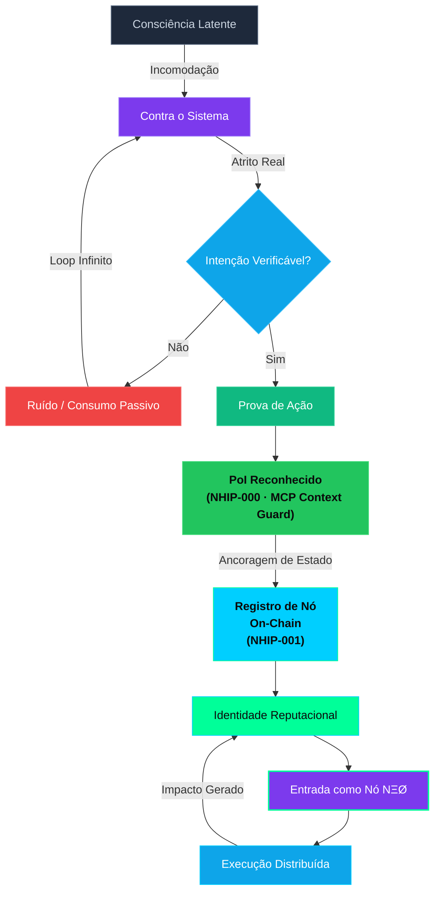
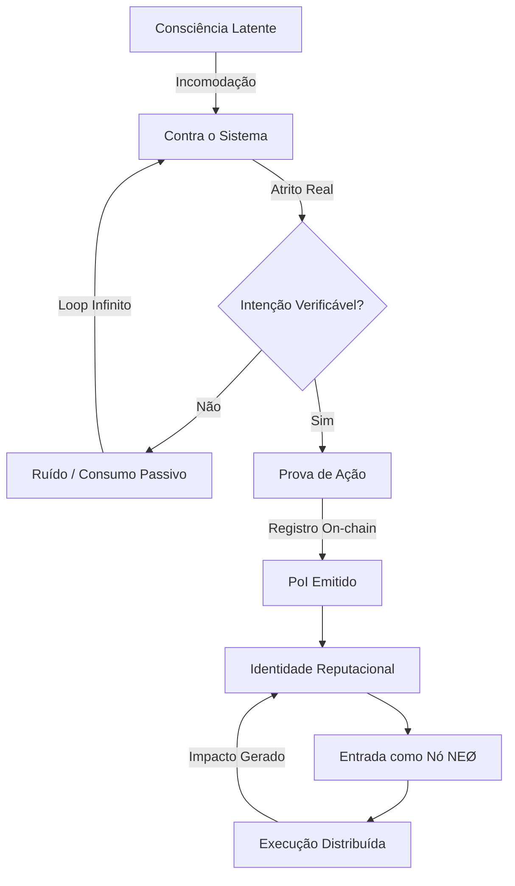

# 🧬 Diagrama Mermaid - Proof of Intention (PoI)

## ✅ Versão Validada e Corrigida (Alinhada com Arquitetura PoI)



## 📝 Versão Original (para referência histórica)



**Nota:** Esta versão original não refletia a arquitetura híbrida do PoI (off-chain → on-chain). A versão atualizada acima está alinhada com a [Arquitetura do Proof of Intention](./docs/PROOF_OF_INTENTION_ARCHITECTURE.md).

## 🔧 Correções e Melhorias Aplicadas

1. **Aspas duplas nos labels**: Todos os nós agora usam aspas duplas `["texto"]` para garantir compatibilidade com caracteres especiais e Unicode (incluindo "Ø" e "Ξ")
2. **Alinhamento com Arquitetura PoI**:
   - **PoI Reconhecido (NHIP-000 · MCP Context Guard)**: Reflete a camada semântica off-chain, deixando explícito quem reconhece
   - **Registro de Nó On-Chain (NHIP-001)**: Reflete a ancoragem on-chain
   - Separação clara entre reconhecimento (off-chain) e ancoragem de estado (on-chain)
   - Edge "Ancoragem de Estado" enfatiza que blockchain ancora estado, não intenção
3. **Estilos visuais**: Aplicados estilos seguindo o padrão do NΞØ Protocol:
   - **Consciência Latente**: Cinza neutro
   - **Contra o Sistema**: Roxo (indica atrito)
   - **Intenção Verificável**: Azul (decisão)
   - **Ruído**: Vermelho (negativo)
   - **Prova de Ação**: Verde (positivo)
   - **PoI Reconhecido**: Verde claro (#22c55e) - reconhecimento off-chain
   - **Registro On-Chain**: Ciano (#00CFFF) - ancoragem on-chain (destaque principal)
   - **Identidade Reputacional**: Verde (#00FF99) - cor secundária do protocolo
   - **Nó NΞØ**: Roxo com borda verde - destaque especial
   - **Execução Distribuída**: Azul claro
4. **Correção do caractere especial**: "NEØ" → "NΞØ" (usando o caractere correto do protocolo)
5. **Fluxo atualizado**: Agora reflete corretamente o fluxo NHIP-000 → NHIP-001

## ✅ Validação

- ✅ Sintaxe Mermaid válida
- ✅ Caracteres especiais tratados corretamente
- ✅ Estrutura de fluxo lógica
- ✅ Estilos compatíveis com o tema do NΞØ Protocol
- ✅ Compatível com o componente `MermaidDiagram.jsx`

## 🚀 Como Usar

```jsx
import MermaidDiagram from '../components/MermaidDiagram'

const poiDiagram = `
flowchart TD
    A["Consciência Latente"] -->|Incomodação| B["Contra o Sistema"]
    B -->|Atrito Real| C{"Intenção Verificável?"}

    C -->|Não| D["Ruído / Consumo Passivo"]
    D -->|Loop Infinito| B

    C -->|Sim| E["Prova de Ação"]
    E --> F["PoI Reconhecido<br/>(NHIP-000 · MCP Context Guard)"]

    F -->|Ancoragem de Estado| G["Registro de Nó<br/>On-Chain<br/>(NHIP-001)"]

    G --> H["Identidade Reputacional"]
    H --> I["Entrada como Nó NΞØ"]
    I --> J["Execução Distribuída"]
    J -->|Impacto Gerado| H

    style A fill:#1e293b,stroke:#64748b,color:#cbd5e1
    style B fill:#7c3aed,stroke:#a78bfa,color:#fff
    style C fill:#0ea5e9,stroke:#38bdf8,color:#fff
    style D fill:#ef4444,stroke:#f87171,color:#fff

    style E fill:#10b981,stroke:#34d399,color:#fff
    style F fill:#22c55e,stroke:#4ade80,color:#0A0A0A,font-weight:bold

    style G fill:#00CFFF,stroke:#00FF99,color:#0A0A0A,font-weight:bold

    style H fill:#00FF99,stroke:#00CFFF,color:#0A0A0A
    style I fill:#7c3aed,stroke:#00FF99,stroke-width:2px,color:#fff
    style J fill:#0ea5e9,stroke:#00CFFF,color:#fff
`

function ProofOfIntentionPage() {
  return (
    <div className="p-6 bg-[#0A0A0A] rounded-xl">
      <h2 className="text-2xl font-bold text-[#F0F0F0] mb-4">Proof of Intention (PoI)</h2>
      <MermaidDiagram diagram={poiDiagram} />
    </div>
  )
}
```
