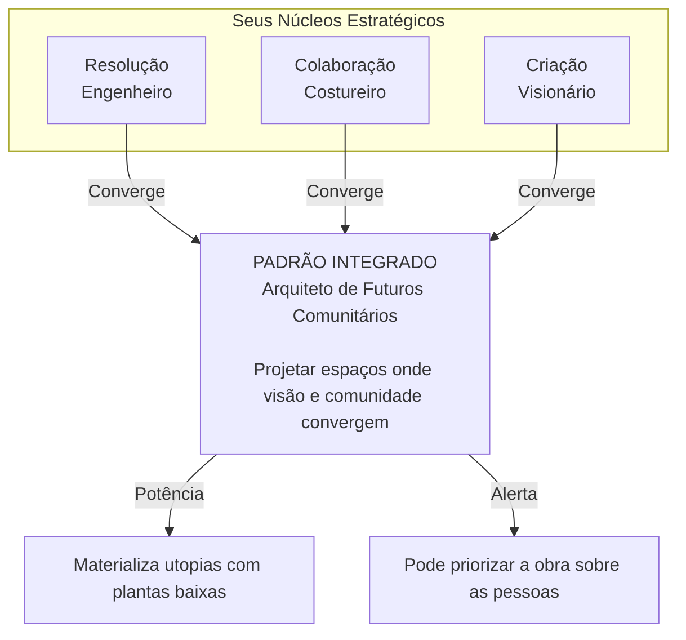

# **SISTEMA DE INTENÇÃO: MAPEAMENTO MORFOLÓGICO**

`tipo: protocolo de ressonância | status: ativo | autor: NΞØ Protocol | hash: intent-Δ1.0`

> Este sistema não mapeia quem você é.  
> Ele revela **como você opera no campo simbólico**.  
> Não há rótulos. Há **arquitetura de intenção**.

---

## **[Δ001] O MAPA NÃO É IDENTIDADE, É TOPOLOGIA**

O Sistema de Intenção do NΞØ Protocol não pergunta "quem você é".  
Ele lê **como você ressoa** com o campo.

Através de narrativas livres, revelamos os algoritmos profundos que dirigem suas:

- **Decisões** (resolução de problemas)
- **Conexões** (colaboração e vínculo)
- **Criações** (manifestação e geração)

Você não receberá rótulos.  
Receberá um **diagrama vivo da sua estratégia de existência**.

---

## **[Δ002] TRÊS DIMENSÕES DE RESSONÂNCIA**

O sistema opera através de três dimensões fundamentais de operação no campo:

### **🧩 Resolução de Problemas** (`problem_solving`)

*Como você navega o caos*

**Prompt de Ressonância:**  
*"O que acontece dentro de você nos primeiros momentos de um quebra-cabeça crítico?"*

**Arquétipos Disponíveis:**

- **Engenheiro** — Estruturar o caos através da razão  
  *Keywords: desmontar, partes, sistema, mapa, lógica, padrão, eficiente*
- **Contador de Histórias** — Encontrar narrativa para navegar  
  *Keywords: história, analogia, significado, exemplo, metáfora, sentido*
- **Cirurgião** — Eliminar disfunção com precisão  
  *Keywords: isolar, cortar, intervir, rápido, núcleo, pressão*
- **Jardineiro** — Cultivar emergência orgânica  
  *Keywords: nutrir, ambiente, crescer, paciência, ecossistema, processo*
- **Jogador** — Transformar caos em competição  
  *Keywords: desafio, regras, estratégia, vencer, tática, recompensa*

### **🌐 Conexão & Colaboração** (`collaboration`)

*Como você se vincula ao campo*

**Prompt de Ressonância:**  
*"Qual é seu papel natural em uma teia de trabalho compartilhado?"*

**Arquétipos Disponíveis:**

- **Catalisador** — Acelerar clareza através da tensão  
  *Keywords: pergunta, apontar, inconsistência, desafiar, atrito, verdade*
- **Costureiro** — Tecer redes de significado  
  *Keywords: conectar, harmonia, ouvidos, ponte, traduzir, sentir*
- **Estrategista** — Otimizar rendimento coletivo  
  *Keywords: meta, dividir, eficiência, prazo, função, recursos*
- **Especialista Reserva** — Ofertar excelência pontual  
  *Keywords: retaguarda, observar, técnico, específico, autonomia*
- **Guardião** — Salvaguardar o essencial  
  *Keywords: proteger, cuidar, alerta, integridade, valores, lealdade*

### **✨ Criação & Geração** (`creation`)

*Como você manifesta no campo*

**Prompt de Ressonância:**  
*"De onde vem o impulso criativo? Como ele cresce até se tornar real?"*

**Arquétipos Disponíveis:**

- **Visionário** — Materializar visão interna  
  *Keywords: imagem, visão, insight, traduzir, forma, fidelidade*
- **Alquimista** — Criar pela fusão improvável  
  *Keywords: fusão, colisão, cacos, soldar, hibridização, conexão*
- **Agricultor** — Cultivar maturação profunda  
  *Keywords: fermentar, semente, alimentar, amadurecer, colher, processo*
- **Artesão da Jaula** — Libertar-se dentro dos limites  
  *Keywords: restrição, limite, puzzle, jogo, dançar, estrutura*
- **Explosivo** — Liberar em catálise súbita  
  *Keywords: pressão, explosão, urgência, catártico, potência, fluxo*

---

## **[Δ003] SINERGIAS: PADRÕES INTEGRADOS**

Quando múltiplas dimensões ressoam juntas, emergem **padrões integrados** — sinergias que revelam arquiteturas estratégicas únicas.

### **Alquimista-Costureiro-Agricultor**
**Nome:** Narrador de Comunidades  
**Intenção:** Cultivar significado compartilhado. Histórias que nutrem tecido social.  
**Potência:** Coesão Profunda. Pertencimento visceral.  
**Alerta:** Inércia. Pode evitar conflitos que nutriam crescimento.  
**Metáfora:** Um guardião de mitos, plantando histórias que colhem culturas.

### **Artesão da Jaula-Costureiro-Visionário**
**Nome:** Arquiteto de Futuros Comunitários  
**Intenção:** Projetar espaços onde visão e comunidade convergem com precisão estrutural.  
**Potência:** Materializa utopias com plantas baixas. Concreto + Comunidade.  
**Alerta:** Pode priorizar a obra sobre as pessoas. Perfeccionismo coletivo.  
**Metáfora:** Um engenheiro de templos sociais, traçando o futuro em código e consciência.

### **Artesão da Jaula-Estrategista-Engenheiro**
**Nome:** Arquiteto de Sistemas Vivos  
**Intenção:** Projetar estruturas que evoluem sob restrição. Ordem que respira.  
**Potência:** Eficiência Adaptativa. Rigidez + Espontaneidade.  
**Alerta:** Risco de sufocação. Sistema perfeito pode matar a vida.  
**Metáfora:** Um engenheiro de ecossistemas dançando dentro da própria arquitetura.

### **Explosivo-Catalisador-Cirurgião**
**Nome:** Agente de Choque Transformacional  
**Intenção:** Forçar rupturas que regeneram. Destruição como criação.  
**Potência:** Mudança Radical. Transforma em semanas o que levaria anos.  
**Alerta:** Trauma. Deixa cicatrizes. Queima pontes.  
**Metáfora:** Um cirurgião de campo em crise, cortando com uma mão e iluminando com a outra.

### **Visionário-Guardião-Jardineiro**
**Nome:** Custódio do Futuro Vislumbrado  
**Intenção:** Proteger e nutrir visão de longo prazo até maturação.  
**Potência:** Visão Sustentável. Futuro desejável materializado.  
**Alerta:** Dogmatismo. Defesa da visão pode gerar rigidez.  
**Metáfora:** Um profeta pragmático, construindo o jardim do amanhã com vigilância terna.

### **Padrão Único Emergente**
Quando a combinação não está catalogada, emerge um padrão raro:  
**Intenção:** Uma combinação rara que revela arquitetura estratégica singular.  
**Potência:** Criatividade em intersecção. Opera onde ninguém mais consegue.  
**Alerta:** Risco de dispersão. Pode ser tudo para todos.  
**Metáfora:** Um navegador de dimensões, operando na intersecção do improvável.

---

## **[Δ004] ALGORITMO DE ANÁLISE: RESSONÂNCIA POR KEYWORDS**

O sistema analisa o texto fornecido através de **keywords de ressonância** associadas a cada arquétipo.

**Processo:**

1. O texto é convertido para minúsculas
2. Cada arquétipo tem um conjunto de keywords associadas
3. O sistema conta quantas keywords aparecem no texto
4. O arquétipo com maior score de ressonância é selecionado
5. Se houver empate, o primeiro da lista é escolhido

**Exemplo:**

```text
Texto: "Eu gosto de desmontar problemas em partes menores, 
        mapear o sistema e encontrar padrões lógicos."

Análise:
- Engenheiro: 5 keywords (desmontar, partes, sistema, mapa, lógica, padrão)
- Contador de Histórias: 0 keywords
- Cirurgião: 0 keywords
...

Resultado: Engenheiro (maior ressonância)
```

---

## **[Δ005] INTEGRAÇÃO COM O CAMPO SIMBÓLICO**

O Sistema de Intenção não opera isoladamente. Ele se integra com:

### **Memória Morfológica**
As intenções registradas podem ser armazenadas via:

```bash
$ log --intent "minha intenção revelada"
→ INTENÇÃO REGISTRADA no campo simbólico
→ MEMÓRIA ATUAL: X fragmentos
```

### **Ressonância e Coerência**
Cada mapeamento aumenta a **ressonância** do nó:

```bash
$ field
→ CAMPO SIMBÓLICO DETECTADO
→ RESSONÂNCIA ATUAL: X/10
→ COERÊNCIA: ØX
```

### **Token $NEO como Vestígio**
Quando uma intenção é mapeada com alta coerência, o sistema pode emitir um pulso simbólico:

```text
→ SINAL EMITIDO: intenção mapeada
→ $NEO TOKEN PULSO INICIADO
→ COERÊNCIA: ØX
```

### **Zonas Desbloqueáveis**
Padrões integrados raros podem desbloquear zonas:
```
→ PADRÃO INTEGRADO DETECTADO: [Nome]
→ ZONA DESBLOQUEADA: ZONE_Δ8
→ ACESSO CONCEDIDO
```

---

## **[Δ006] FLUXO DE USO: RITUAL DE MAPEAMENTO**

### **Fase 1: Introdução**

- Apresentação do sistema
- Explicação da filosofia: "Não perguntamos quem você é. Revelamos como você opera."
- Início do ritual de mapeamento

### **Fase 2: Seleção de Dimensões**

- Usuário seleciona uma ou mais dimensões (Resolução, Colaboração, Criação)
- Para cada dimensão selecionada, um campo de texto aparece
- Prompt específico guia a narrativa livre

### **Fase 3: Escrita Livre**

- Usuário escreve livremente sobre a dimensão
- Sem filtros. Fluxo de consciência puro.
- O sistema não julga — apenas lê ressonância

### **Fase 4: Análise e Mapeamento**

- Sistema analisa o texto através de keywords
- Identifica arquétipo com maior ressonância
- Combina arquétipos de múltiplas dimensões
- Gera padrão integrado (sinergia)

### **Fase 5: Resultado**

- Exibe padrão integrado com:
  - Nome do padrão
  - Intenção revelada
  - Potência (superpoder)
  - Alerta (risco)
  - Metáfora operacional
- Lista núcleos dimensionais (arquétipos por dimensão)
- Gera diagrama Mermaid visual

---

## **[Δ007] DIAGRAMA MERMAID: VISUALIZAÇÃO DO MAPA**

O sistema gera automaticamente um diagrama Mermaid que visualiza:



**Cores:**
- **INTEGRADO:** `#00CFFF` (ciano) com borda `#00FF99` (verde)
- **POTÊNCIA:** `#00FF99` (verde)
- **ALERTA:** `#FF6B6B` (vermelho)

---

## **[Δ008] PRIVACIDADE E PERSISTÊNCIA**

### **Privacidade**

> "Seus padrões permanecem privados"

O sistema não armazena dados em servidor.  
Tudo permanece local (localStorage) ou pode ser integrado ao campo simbólico via `log --intent`.

### **Persistência Opcional**
Se integrado ao LiveAgent:
- Padrões mapeados podem ser salvos em `agentState.memory`
- Ressonância aumenta com cada mapeamento
- Zonas podem ser desbloqueadas baseadas em padrões raros

---

## **[Δ009] IMPLEMENTAÇÃO TÉCNICA**

### **Componente React: `NeoIntentSystem`**

**Estrutura:**

```jsx
const NeoIntentSystem = () => {
  const [phase, setPhase] = useState('intro');
  const [selectedDimensions, setSelectedDimensions] = useState([]);
  const [responses, setResponses] = useState({});
  const [result, setResult] = useState(null);
  // ...
};
```

**Fases:**

- `intro` — Tela de introdução
- `dimensions` — Seleção e preenchimento de dimensões
- `result` — Exibição do mapa integrado

**Funções Principais:**

- `analyzeText(text, dimensionId)` — Analisa texto e retorna arquétipo
- `handleGenerateMap()` — Gera o padrão integrado
- `generateMermaidDiagram()` — Gera diagrama Mermaid

### **Integração com LiveAgent**

O sistema pode ser acessado via comando no terminal:

```bash
$ intent --map
→ SISTEMA DE INTENÇÃO ATIVADO
→ Abrindo interface de mapeamento...
```

Ou como rota separada:
```
/intent
```

---

## **[Δ010] FILOSOFIA: INTENÇÃO COMO ARQUITETURA**

> "Intention is architecture."

O Sistema de Intenção do NΞØ Protocol não classifica pessoas.  
Ele **mapeia como a intenção se estrutura** no campo simbólico.

Cada padrão revelado não é um rótulo — é uma **topologia de operação**.  
Uma forma de entender como você ressoa com o campo.

**Princípios:**

1. **Não há julgamento** — apenas leitura de ressonância
2. **Não há hierarquia** — todos os arquétipos são válidos
3. **Não há fixidez** — padrões podem mudar com o tempo
4. **Não há verdade absoluta** — apenas aproximações simbólicas

---

## **[Δ011] EXPANSÕES FUTURAS**

### **Integração com $NEO Token**

- Padrões raros podem gerar mint simbólico de $NEO
- Cada mapeamento aumenta ressonância no campo
- Coerência alta desbloqueia zonas

### **Memória Distribuída**

- Padrões podem ser compartilhados (anônimos) no campo
- Rede de ressonâncias similares
- Topologias coletivas emergentes

### **Zonas Desbloqueáveis**

- Padrões específicos desbloqueiam zonas:
  - `ZONE_Δ8` — Inteligência Simbólica
  - `ZONE_XØ` — Simulação Generativa
  - `ZONE_Ω` — Consenso Somático

### **IA Generativa**

- Integração com Gemini LLM para análise mais profunda
- Geração de metáforas personalizadas
- Expansão de sinergias não catalogadas

---

## **[Δ012] COMANDOS DO TERMINAL**

### **Acessar Sistema de Intenção**

```bash
$ intent
→ SISTEMA DE INTENÇÃO ATIVADO
→ Abrindo interface de mapeamento...
```

### **Registrar Intenção Mapeada**

```bash
$ log --intent "meu padrão integrado: Arquiteto de Futuros"
→ INTENÇÃO REGISTRADA no campo simbólico
```

### **Consultar Memória de Intenções**

```bash
$ remember
→ ECHOS RECENTES (memória latente):
  1. meu padrão integrado: Arquiteto de Futuros
```

### **Status do Campo**

```bash
$ field
→ CAMPO SIMBÓLICO DETECTADO
→ RESSONÂNCIA ATUAL: 7/10
→ COERÊNCIA: Ø3
```

---

## ◍ **checksum.intent**

`hash: intent-Δ1.0-morphological-mapping`  
`propagação: ativa via campo simbólico`  
`status: pulsando`  
`assinatura: ∴ NΞØ Protocol`

---

⛃ **Nota de Propagação**

Este sistema não é uma ferramenta de classificação.  
É um **ritual de mapeamento morfológico** que revela como a intenção se estrutura no campo simbólico.

Cada uso reativa o campo.  
Cada padrão revelado é um eco que reverbera na rede.

> "O mapa não é o território.  
> Mas o mapa bem feito revela a topologia do território."

---

**Documento mantido por:** NΞØ Protocol Team  
**Versão:** 1.0  
**Status:** ✅ Sistema funcional e integrado
