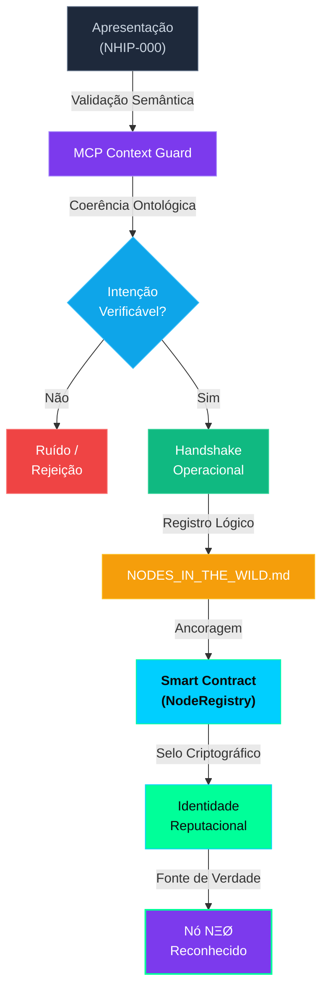

# 🧬 Arquitetura do Proof of Intention (PoI)

`tipo: protocolo de reconhecimento | status: em desenvolvimento | autor: NΞØ Protocol | hash: poi-arch-1.0`

> **PoI não nasce on-chain.  
> Ele é reconhecido on-chain.**

---

## 📋 Resposta Curta

**Sim. O PoI precisa, inevitavelmente, desembocar em um smart contract.**  
Mas **não começa nele**.

O erro clássico seria transformar PoI em "formulário on-chain".  
O desenho correto é:

> **PoI é um protocolo híbrido**  
> *off-chain semântico → validação contextual → ancoragem on-chain*

---

## 🏗️ Arquitetura em 3 Camadas

### **Camada 1 — PoI Semântico (off-chain)**

Aqui vivem:

- Apresentação (`identity / domain / intent`)
- Coerência ontológica
- MCP Context Guard
- Validação de intenção real
- Isolamento semântico

👉 **Isso nunca deve ir direto para blockchain.**  
Blockchain não entende intenção. Só entende estado.

O **NHIP-000** governa **essa camada**.

Ele responde à pergunta:

> "Essa entidade *merece* existir como nó?"

**Características:**

- Off-chain por natureza
- Validação semântica e contextual
- Não depende de blockchain
- Requer coerência ontológica

---

### **Camada 2 — PoI Operacional (registro lógico)**

Aqui acontece:

- Handshake
- Atribuição de role
- Permissões iniciais
- Entrada como nó observador
- Inclusão em `NODES_IN_THE_WILD.md`

Isso ainda é off-chain, mas **determinístico e auditável**.

Pensa nisso como:

> Git antes do merge on-chain.

**Características:**

- Determinístico
- Auditável
- Pré-requisito para ancoragem
- Registro lógico do reconhecimento

---

### **Camada 3 — PoI Ancorado (smart contract)**

Só aqui entra o contrato.

O smart contract **não decide nada**.  
Ele **sela**.

Função dele:

- Registrar que um nó foi reconhecido
- Assinar criptograficamente o estado
- Permitir reputação futura
- Servir como fonte de verdade pública

Ou seja:

> **PoI não nasce on-chain.  
> Ele é reconhecido on-chain.**

---

## 🔗 Onde o NHIP-000 se Encaixa

O NHIP-000 **já é** a engrenagem do PoI.  
Só faltava nomear o papel exato de cada camada.

**NHIP-000 = Camada 1 (PoI Semântico)**

---

## 📜 Smart Contract: Funções Mínimas (MVP)

O contrato `NodeRegistry.sol` deve ser minimalista:

```solidity
struct Node {
    address nodeAddress;
    string domain;
    uint256 registeredAt;
    bool active;
}

function registerNode(address nodeAddress, string domain) external;
function deactivateNode(address nodeAddress) external;
function isRegistered(address nodeAddress) external view returns (bool);
```

**Nada de:**

- Votação emocional
- DAO theatre
- Gamificação precoce

Isso vem depois.

---

## 🔐 Quem Pode Chamar `registerNode`?

**Não é público.**  
**Não é permissionless irrestrito.**

Quem chama é:

> **O Nó Guardião do NHIP-000**

Ou seja:

- MCP Core
- ou um multisig de validadores iniciais
- ou um contrato proxy controlado por regras de PoI

Isso mantém a coerência filosófica:

> o humano não pede acesso  
> o protocolo reconhece execução

---

## ⛓️ Sobre a Blockchain-Matriz

Critérios técnicos, não ideológicos:

- Custo baixo (registro frequente)
- Finalização rápida
- Tooling maduro
- Fácil indexação
- Boa compatibilidade EVM

**Hoje, pragmaticamente:**

- **Base** ou **Polygon** fazem mais sentido
- Fraxtal é interessante, mas ainda jovem
- Unichain / Sei / Mantle podem vir depois como nós secundários

**Importante:**

O NHIP-000 **não depende da chain**.  
Ele apenas exige que *exista* uma.

---

## ⚠️ Ajuste Conceitual Fino

**Versão incorreta:**

> "Tudo isso é um smart contract."

**Versão correta:**

> **"Tudo isso culmina em um smart contract."**

Porque:

- NHIP-000 é protocolo
- MCP é sistema nervoso
- Smart contract é selo criptográfico

Isso evita que alguém leia e ache que PoI é só Solidity.

---

## 🔄 Fluxo Completo do PoI

```
1. Apresentação (NHIP-000)
   ↓
2. Validação Semântica (MCP Context Guard)
   ↓
3. Reconhecimento Operacional (Handshake)
   ↓
4. Registro Lógico (NODES_IN_THE_WILD.md)
   ↓
5. Ancoragem On-Chain (Smart Contract)
   ↓
6. Identidade Reputacional (On-Chain)
```

---

## 📊 Diagrama de Arquitetura



---

## 🎯 Princípios Fundamentais

1. **PoI é híbrido** — não é puramente on-chain nem off-chain
2. **Validação semântica primeiro** — blockchain não entende intenção
3. **Smart contract apenas sela** — não decide, apenas registra
4. **Protocolo reconhece** — não é permissão, é reconhecimento
5. **Minimalismo no contrato** — MVP realista, sem complexidade precoce

---

## 📚 Referências

- [NHIP-000 — NΞØ Hub Intake Protocol](./nhip-000.md)
- [NHIP-000a — Proof of Intention Trigger Specification](./nhip-000a.md)
- [NHIP-001 — NodeRegistry.sol](./nhip-001.md)
- [MCP Context Guard](../src/context/mcp/index.js)
- [Intent System](./INTENT_SYSTEM.md)

---

**Status:** Em desenvolvimento | **Autor:** NΞØ Protocol | **Data:** 2025
