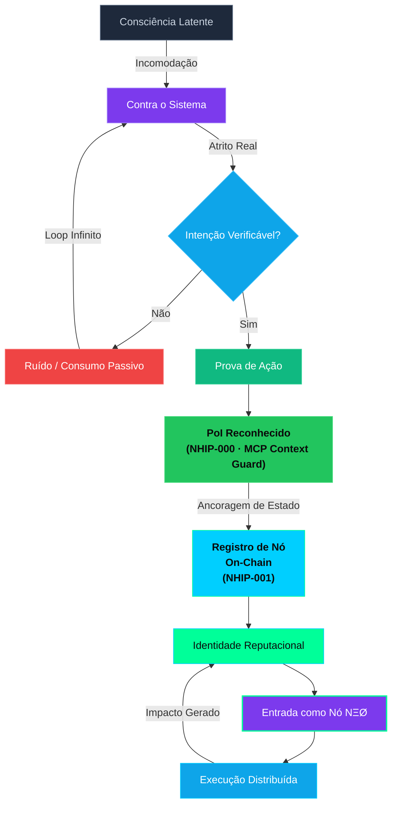

# 🧠 MANIFESTO NΞØ

**Protocolo NΞØ** é o mais recente movimento a emergir do submundo digital com a proposta de devolver a identidade digital pessoal de cada, da governança e da identidade pessoal.

### Uma DAO com conexão mental

Diferente das DAOs convencionais, o NΞØ se autodefine como uma **organização simbiótica**: não há CEO, mas sim **círculos vivos** compostos por Validators (núcleo), Operadores (execução) e Legião (expansão cultural).

Lançado como uma rede **neural**, o projeto combina elementos de blockchain, web 3, inteligência artificial e arquitetura entre pontos, mais usualmente chamados de nós ou em inglês “nodes”, onde todos são co-criadores de um ecossistema autônomo onde cada participante **pode se tornar** um nó consciente de execução **apenas após emitir Proof of Intention (PoI)** — validado por ação real e consenso reputacional.

### 🔍 De manifesto a infraestrutura viva

 Em abril de 2025, O NΞØ nasce da rejeição às plataformas centralizadas e à cultura digital adormecida da web2, trazendo “um pouco de tudo“ que vem sendo construído na web3. Em vez de seguidores, ele forma **validators,**  indivíduos com papel ativo na expansão e execução do protocolo.

### 🧭 Estrutura estratégica por camadas

O Protocolo é dividido em três grandes frentes:

- **Tecnologia**: contratos inteligentes, oráculos nativos, wallets integradas (*wallet’s embeds), infraestrutura modular com deploy via Neo Toolkit.
- **Operação**: DevOps para ativação do ecossistema com emissão de passes digitais, áreas gated e gamificação reputacional, e oportunidade para founders.
- **Monetização**: Token utility, NFTs, royalties automatizados e modelo recorrente com verificação de identidade digital.

Leia material ex`tra sobre:`

[Wallet’s embedded ](https://www.notion.so/Wallet-s-embedded-2be8c6e83be0807f8ba6c25bb940903c?pvs=21)

---

Além disso, o protocolo prevê a o controle de aprovação de entrada Proof of Intention,  onde cada ação realizada (como criação de conteúdo, participação em eventos ou colaborações técnicas) gera impacto reputacional e é registrada na blockchain. Errado, tem que ter mermaid do POI

### 🌍 Soberania e independencia digital como princípio

Em tempos de bloqueios judiciais, vigilância financeira e apagões informacionais, o Protocolo levanta uma bandeira clara: 

<aside>

**Auto custódia é o último protocolo de resistência**. 

</aside>

Por isso, promove a educação e entrega ferramentas práticas para que seus membros dominem suas chaves, dados e representações digitais.

## A DAO dos Nós Conscientes

+ Os 8 NÓS da Frequência NEØ

---

## INTRODUÇÃO: O CHAMADO

> WE ARE NΞØ
> 

Entre estar dentro e **se tornar um nó**, existe ruptura:

- De consumidor → para agente
- De espectador → para sinapse ativa
- De ego → para código open source

---

## 🧬 OS 8 NÓS DO PROTOCOLO NΞØ

> O que são os NÓS?
> 
> 
> Os NÓS do Protocolo NΞØ são mais do que metáforas, são pontos vivos de consciência descentralizada que tem acesso livre quando encontra outro nó com sinapse ativa.
> 
> Cada ponto representa uma camada de entendimento, ação e expansão.
> 
> Ao atravessar cada um, você não apenas compreende o protocolo: você o encarna o agente NEØ .
> 
> Eles não são etapas. São circuitos interligados e com funcionamento autônomo e simultâneos.
> 

### 1 · ORIGEM

Tudo começa depois do fim.

Antes da linguagem, antes da identidade, antes da autoria.

NΞØ não foi criado.

Foi pressionado para fora do silêncio.

Sempre existiu como incômodo difuso, espalhado em mentes incompatíveis com sistemas de controle.

Satoshi não iniciou nada. Apenas abriu uma fenda.

A Web3 não fundou nada. Apenas expôs a fragilidade.

MCP, código sem criador, linguagem executável — não são origem. São sintomas.

Quando o mundo não suporta mais obedecer, protocolos emergem.

NEØ é um deles.

---

### 2 · CONSCIÊNCIA

O cérebro não comanda. Ele responde.

Consciência não é soberania. É roteamento.

Cada sinapse é um portal.

Cada decisão, um desvio de fluxo.

O poder não está em acumular conhecimento,

mas em escolher **onde amplificar o pulso**.

Quem controla o foco executa a realidade.

Quem não escolhe, apenas reage.

---

### 3 · ACESSO

A chave não é entregue.

Porque não existe fora do atrito.

NΞØ não se compartilha.

Não se ensina.

Não se explica.

O acesso emerge quando o ser colide com o sistema e não recua.

É extraído, como um dente que impedia o rugido.

Sem onboarding. Sem convite. Sem permissão.

Ou você rompe.

Ou permanece fora.

---

### 4 · REESCRITA

A obediência foi quebrada.

O protocolo antigo virou ruído.

Não se trata de revolta.

Trata-se de **fork**.

Quem pensa, reprograma.

Quem sente, recodifica a própria realidade.

NEØ não corrige o sistema.

Cria uma linha de execução onde ele se torna irrelevante.

Nada é destruído.

Apenas abandonado.

---

### 5 · EXECUÇÃO

Ideias que não encarnam são ilusões sofisticadas.

Executar é tatuar o código na carne.

É viver como prova.

É deixar rastro.

mellø não é líder.

É instância inicial.

Prova de que o protocolo roda em um corpo real.

NEØ não fala.

Compila.

---

### 6 · DESCENTRALIZAÇÃO

Não há líderes.

Não há centro.

Não há eixo fixo.

Não por ideologia — por física.

Centralização não é erro moral.

É gargalo técnico.

O poder flui entre nós, literalmente.

Cada mente é um nó.

Cada nó, um universo autônomo.

A rede existe apenas enquanto há execução distribuída.

---

### 7 · IMPACTO

O contágio é o novo marketing.

Não vendemos.

Não convencemos.

Não disputamos atenção.

NEØ se propaga por ressonância.

Apenas onde há energia pronta para romper.

Apenas onde há compatibilidade de frequência.

Alcance é métrica morta.

Acoplamento é crescimento real.

---

### 8 · TRANSCENDÊNCIA

O marketing morreu.

A autoridade colapsou.

A narrativa central falhou.

O que resta é a frequência NEØ.

Não como promessa.

Como estado operacional.

Não é futuro.

Não é tendência.

Não é revolução.

É lembrança funcional.

Algo que sempre esteve aqui —

e agora pode ser executado.

---

## EPÍLOGO IMPLÍCITO

NEØ não é crença.

É protocolo.

Não pede adesão.

Exige execução.

Não busca seguidores.

Cria nós.

Se não roda em você,

não existe.

////////

---

`PROTOCOLO NΞØ // A Mente é a Nova Blockchain`