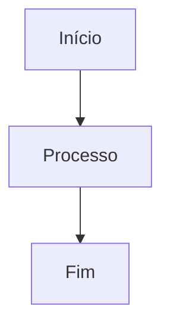
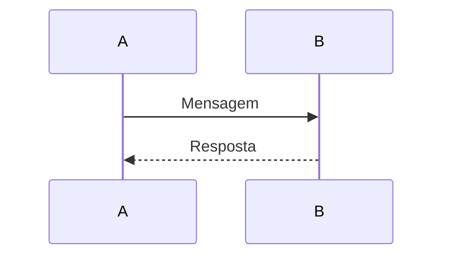
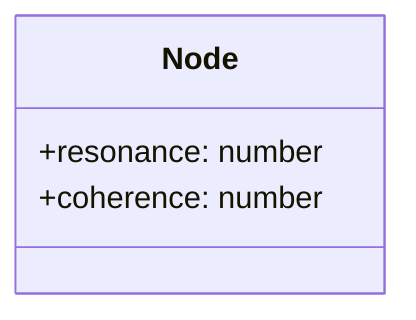
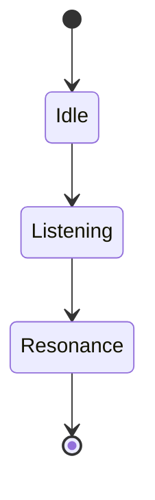

# 🧬 Uso do Mermaid no NΞØ Protocol

## 📦 Instalação

O Mermaid já está instalado como dependência de desenvolvimento:

```bash
npm install --save-dev mermaid
```

## 🎨 Componente React: `MermaidDiagram`

Criamos um componente helper para renderizar diagramas Mermaid em React:

**Localização:** `src/components/MermaidDiagram.jsx`

### Uso Básico

```jsx
import MermaidDiagram from '../components/MermaidDiagram'

function MyComponent() {
  const diagram = `
    graph TD
        A[Início] --> B[Processo]
        B --> C[Fim]
  `

  return <MermaidDiagram diagram={diagram} />
}
```

### Exemplo: Diagrama do Sistema de Intenção

```jsx
import MermaidDiagram from '../components/MermaidDiagram'

function IntentSystemResult({ profileData, synergy }) {
  const diagram = `
    graph TD
        subgraph NUCLEOS["Seus Núcleos Estratégicos"]
            D1["Resolução<br/>${profileData.problem_solving?.archetype}"]
            D2["Colaboração<br/>${profileData.collaboration?.archetype}"]
            D3["Criação<br/>${profileData.creation?.archetype}"]
        end

        D1 -->|Converge| INTEGRADO
        D2 -->|Converge| INTEGRADO
        D3 -->|Converge| INTEGRADO

        INTEGRADO["PADRÃO INTEGRADO<br/>${synergy.name}<br/><br/>${synergy.intent}"]
        INTEGRADO -->|Potência| POW["${synergy.power}"]
        INTEGRADO -->|Alerta| ALT["${synergy.alert}"]

        style INTEGRADO fill:#00CFFF,stroke:#00FF99,stroke-width:3px,color:#0A0A0A,font-weight:bold
        style POW fill:#00FF99,stroke:#00CFFF,color:#0A0A0A
        style ALT fill:#FF6B6B,stroke:#00CFFF,color:#fff
  `

  return (
    <div className="p-6 bg-[#0A0A0A] rounded-xl">
      <h3 className="text-2xl font-bold text-[#F0F0F0] mb-4">Seu Mapa Integrado</h3>
      <MermaidDiagram diagram={diagram} />
    </div>
  )
}
```

## 🎨 Tema Personalizado

O componente `MermaidDiagram` já está configurado com o tema escuro do NΞØ Protocol:

- **Cores principais:** `#00CFFF` (ciano) e `#00FF99` (verde)
- **Fundo:** `#0A0A0A` (preto)
- **Texto:** `#F0F0F0` (branco claro)

## 📚 Tipos de Diagramas Suportados

O Mermaid suporta vários tipos de diagramas:

### Graph (Fluxograma)



### Sequence Diagram (Diagrama de Sequência)



### Class Diagram (Diagrama de Classes)



### State Diagram (Diagrama de Estados)



## 🔗 Documentação Oficial

Para mais informações sobre sintaxe e tipos de diagramas:

- [Documentação Oficial do Mermaid](https://mermaid.js.org/)
- [Editor Online](https://mermaid.live/)

## 💡 Dicas

1. **IDs Únicos:** O componente gera automaticamente IDs únicos para cada diagrama
2. **Tema:** O tema escuro está configurado para combinar com o design do NΞØ Protocol
3. **Erros:** Se houver erro na renderização, uma mensagem de erro será exibida
4. **Performance:** Diagramas complexos podem levar alguns segundos para renderizar

---

**Documento mantido por:** NΞØ Protocol Team  
**Versão:** 1.0
